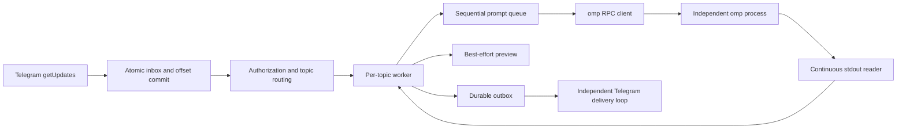
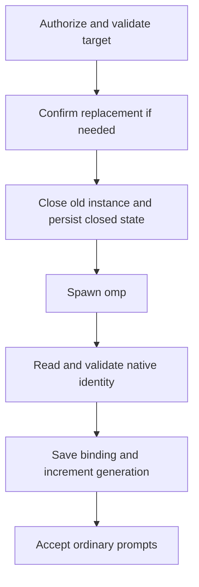

# Architecture and development

[中文版](architecture.zh.md) | [User guide](../README.md)

This document describes the current implementation. Proposed startup-intent changes are explicitly separated from implemented behavior.

## Scope and ownership

The bridge owns Telegram polling, authorization, topic routing, subprocess startup/shutdown, and reliable message delivery. omp owns model execution, tools, configuration, credentials, and native session history.

The deployment model is one bot per database and one worker per topic. There is no terminal emulation, second model transcript, multi-bot dispatcher, generic backend abstraction, or automatic replay of uncertain tasks. Different sessions do not isolate filesystems or credentials.

## Modules

| Location | Responsibility |
| --- | --- |
| [`cmd/omp-telegram`](../cmd/omp-telegram/main.go) | CLI, version output, data-directory lock, signal handling |
| [`internal/config`](../internal/config/config.go) | TOML, environment references, path defaults, startup-argument validation |
| [`internal/bridge`](../internal/bridge/bridge.go) | Worker actors, commands, prompt queues, previews, final replies, host tools |
| [`internal/bridge/recovery.go`](../internal/bridge/recovery.go) | Startup restoration and persisted close state |
| [`internal/bridge/resume_picker.go`](../internal/bridge/resume_picker.go) | Native session listing and authorized, expiring selection menus |
| [`internal/omp`](../internal/omp/client.go) | RPC framing, request correlation, events, native session metadata and ACP listing |
| [`internal/telegram`](../internal/telegram/client.go) | Bot API, attachment transport, sanitized errors and delivery certainty |
| [`internal/media`](../internal/media/media.go) | Workspace-confined file handling, image preparation and outgoing snapshots |
| [`internal/store`](../internal/store/store.go) | SQLite schema, bindings, durable input/output and completion transactions |
| [`config.go`](../config.go) | Embeds the canonical [`config.toml`](../config.toml) |

## Runtime flow



Startup proceeds through configuration loading, the data-directory lock, database initialization/reconciliation, `getMe`, database bot-ownership checking, command registration, restoration, then polling and delivery. `--version` returns before configuration loading. `--check` validates local configuration and creates the configured directories; it does not open the database or authenticate with Telegram.

Incoming updates are persisted before routing authorization. Unauthorized inputs are marked ignored and cannot start a process, download a file, or execute a command. Users and chats must both be allowed; messages without a topic receive guidance rather than an inferred destination.

### Concurrency

- Each topic has an actor-like worker. Ordinary prompts run sequentially; different workers may run concurrently.
- Commands and callbacks use the worker's control path rather than waiting behind queued prompts. This does not promise that every operation is nonblocking: startup and some control RPC round trips still take time.
- Attachment preparation and uploads are asynchronous and bounded. Pending preparation retains its queue position.
- The RPC stdout reader never performs Telegram HTTP delivery. Its event buffers are bounded; protocol violations or overload fail the client rather than allowing unbounded growth.
- A global slot limit bounds active topic instances. Native session-list queries have a separate concurrency limit.

The client waits for `ready`, negotiates protocol v2, serializes stdin writes, and correlates responses by request ID. A successful `Call("prompt")` means acceptance, not task completion. Terminal agent events or a local-command completion signal finish the task; nonterminal events must not dispatch the next queued prompt. Framing and reassembly have explicit bounds, with no PTY/ANSI parsing fallback.

## Identity and stale work

| Identity | Representation |
| --- | --- |
| Bot | Numeric ID returned by `getMe`, not its token or username |
| Topic | `(bot, chat, thread)` |
| Live worker incarnation | Topic plus `generation` and its current client |
| Saved conversation | Native omp session-file path |
| Inbound update | Telegram update ID, unique within this bot-owned database |

`CheckBot` rejects another bot using the same database. `daemon.lock` prevents two bridge processes from opening the same data directory concurrently. Operators must still avoid running the same bot with another data directory or polling client.

A successful new/resumed instance increments the persisted generation. Background results are checked against the appropriate generation, turn, request token, or client identity. Session claims prevent two workers in this daemon from opening the same native conversation concurrently. Claims do not lock a workspace against other programs.

**The acceptance boundary matters:** stale runtime work must not affect a replacement instance, but already committed outbox results remain deliverable after `/new` or `/close`. A later generation is not permission to discard accepted results.

## SQLite

The database is `omp-telegram.db` under `data_dir`. It uses WAL, a busy timeout, and one open connection. It stores bridge state and Telegram message content, not an independent copy of omp's model context.

| Table | Key / fields | Role |
| --- | --- | --- |
| `meta` | `key`, integer `value` | Owning bot ID and polling offset |
| `bindings` | PK `(bot,chat,thread)`; `workspace,session,generation,running` | Current validated session binding and restoration eligibility |
| `history` | `bot,chat,thread,workspace,session,generation` | Previous binding snapshots, not a session browser |
| `inbox` | PK `id`; `raw,state` | Update deduplication and processing state |
| `outbox` | Autoincrement `id`; `chat,thread,text,state,kind,path,name` | Ordered text/attachment delivery |

The hot-path indexes are `inbox(state,id)` and `outbox(state,id)`. There is no automatic retention cleanup, retry scheduler, `source_update/seq` mapping, or multi-bot namespace for inbox/outbox.

### Schema version

`PRAGMA user_version` is the schema version, currently 1. An empty database creates all tables, indexes, and the version in one transaction. Reopening v1 preserves its schema and reconciles runtime states.

Populated unversioned databases and unsupported versions are rejected before schema or record changes. Development-era field probing and compatibility ALTERs are intentionally absent. After release, schema changes require explicit version-to-version transactional migrations, with the version advanced only on success. An older binary must reject a newer schema. Application versions and database versions evolve independently.

### Input and completion transactions

```text
Telegram update
  -> transaction: insert inbox pending + advance offset
  -> authorize and route
  -> persist submitted
  -> write prompt to omp stdin
  -> receive terminal completion
  -> transaction: persist every final text part + set inbox done
```

`Accept` performs one atomic transaction per update. Offset advancement never precedes durable input, and duplicates do not overwrite the original stored update.

For ordinary tasks, `CompleteInboxWithReplies` requires a submitted input and commits all final text parts with `done`. Any failure rolls back both. `say()` remains a notification helper, not the completion API. Control-command completion is handled separately. Tool attachments can be queued during execution and are not retroactively included in the final-text transaction.

A database completion failure stops the worker rather than pretending the task completed. On restart, submitted inputs become `uncertain`; previously pending ordinary messages are canceled. Pending controls still pass normal authorization, and old in-memory callback tokens expire when their state is lost.

### Output delivery

```text
pending -> sending -> done
                   -> failed
                   -> uncertain

restart: sending -> uncertain
```

The Telegram client classifies failures at the transport boundary:

- Local pre-send failures and trustworthy, complete API rejections are definite failures.
- Transport interruption, incomplete responses, or otherwise unconfirmed delivery remain uncertain.
- HTTP status alone is insufficient. Prior uncertainty must not be erased by a later local failure.

There is no new automatic resend for either terminal error state. Explicit Telegram rate limits retain bounded retries. A database transaction cannot atomically commit a Telegram network side effect, so exactly-once delivery is not promised.

## Session lifecycle

`/new` resolves a working directory and, when replacing a live instance, requires confirmation. After startup, the bridge reads native identity using `get_state` and structured `/session info` command output, validates the result, registers its host tools, then saves the binding.

`/resume` obtains the current directory's session list from a short-lived native `omp acp` process using `session/list`. The bridge does not scan session files or synthesize this list from `history`. Selection menus use random tokens with owner, topic, generation, expiry, and cancellation checks. Explicit `/resume ID` delegates native lookup to omp and may restore its original directory.

`running` is restoration eligibility, not a live PID indicator:

| Event | Persisted behavior |
| --- | --- |
| Successful start/resume | Save native identity and `running=1` |
| Normal daemon shutdown | Preserve restoration eligibility |
| `/stop` | Keep the instance and eligibility; clear waiting prompts |
| `/close` | Persist `running=0`, then close the instance |
| Runtime failure closed by the worker | Clear eligibility; active task becomes uncertain |
| Automatic restoration failure | Preserve saved identity and eligibility for manual recovery or a later service restart |

Startup recovery is scoped to the current bot and allowed chats, respects worker capacity, and restores the exact saved session file and directory. Missing files/directories do not trigger a replacement conversation. A fresh omp session may report an identity before its history file exists.

## Process and file safety

- Launch argv directly, without a shell. Explicit `omp_args` cannot replace bridge-owned RPC, cwd, or session lifecycle options.
- Normal shutdown closes stdin, drains output, then escalates through process-group termination when necessary. Each process has one owner of `Wait`.
- Linux RPC and ACP launches use parent-death SIGTERM. Because Linux ties this signal to the creating OS thread, that thread stays locked until `Wait` completes, costing one locked thread per live native child.
- Parent-death signaling is not process-tree containment. Ignored signals, surviving descendants, escaped groups, or cleared parent-death settings require a deployment-level containment boundary. No systemd/supervisor configuration is imposed by the project.
- Incoming attachments are confined to the selected workspace and retained under `.telegram/incoming/`. Outgoing files are copied to private snapshots under `data_dir/attachments/outbox/` before enqueueing. Confirmed deliveries remove snapshots; failures retain them.
- Host tool calls are scoped to the active topic/request and cannot select another Telegram destination. Raw RPC state, provider headers, credentials, and system prompts must not be logged or sent as status output.

## Configuration and path contracts

Bridge defaults are relative to the real executable directory after symlink resolution, not the caller's cwd. Explicit relative `--config` paths are caller-relative; relative `data_dir` and `workspace_root` remain executable-relative even when the config file is elsewhere.

The root `config.toml` is embedded once. Only an absent implicit default file selects the embedded configuration; explicit missing files and unreadable/invalid files fail. Environment expansion happens after TOML parsing and only once. `omp_args` uses quoting-aware tokenization, not shell execution. omp's own defaults remain untouched unless explicitly configured or changed by a requested RPC command.

## Startup intent: design only

The current sequence is:



The close step is skipped if no instance needs replacing. A crash between closing/spawning and saving the new binding can lose the pending create/switch target. The existing startup restoration does not eliminate that window.

Any future design must distinguish:

| Case | Required distinction |
| --- | --- |
| A. Explicit new request, native identity unknown | A durable create intent, not an assumption inferred from an empty session field |
| B. Known session cannot be restored | Preserve its identity; never fall back to new |
| C. Identity known, native history not yet persisted | Not equivalent to A; do not fabricate history or silently replace the session |

The proposed boundary is a prepare transaction recording an explicit operation, frozen target, and attempt generation before spawn, followed by a guarded publish transaction after native identity validation. Preserve the last validated identity until the transition is resolved; `/close` must cancel any pending intent. Merely making `session` nullable or moving `Save` is insufficient.

**This intent model and its database fields are not implemented.** Automatic retry of an uncertain create operation is not introduced. Residual-process handling and crash-window behavior must be established before implementing it.

## Development and release

```sh
just build
just check
just install
```

`just check` runs tests, race checks, and vet. `just install` copies only the binary. `just test` is a maintainer convenience: it installs first, then runs `supervisord ctl restart omp-telegram` using an already configured service. It is not the unit-test command.

Keep regression tests for observable behavior: atomic rollback, restart identity, authorization, cancellation, delivery uncertainty, and process ownership. Use isolated workspaces/databases for real omp smoke tests. Do not describe injected Telegram input or simulated callbacks as phone-originated end-to-end validation.

Current evidence includes transactional failure injection, index query plans, real omp restart recovery, and real Telegram file transfers with injected input. A parent-SIGKILL probe observed a cooperating native omp/tool tree exit, while isolated fixtures demonstrated that non-cooperating descendants can survive. Actual user-client input/clicks, the full live fault matrix, and successful long-session compaction still need acceptance.

Application version comes from `Version` in [`cmd/omp-telegram/main.go`](../cmd/omp-telegram/main.go), initially `v0.1.0`. `--version`/`-v` includes Git revision/dirty metadata when available; `-ldflags "-X main.Version=..."` can override the base version.

The [release workflow](../.github/workflows/release.yaml) runs on PRs, `main`/`dev` pushes, and manual dispatch. It builds/tests Linux amd64 and arm64 natively, with race checks on amd64. A new source version on `main` creates a formal release without rewriting an existing version tag. Other builds use `dev-<version>`; successful `main`/`dev` runs also update the `dev` tag and development draft. PRs and manual runs on other branches never publish.

Release archives contain the binary and LICENSE, with `SHA256SUMS` alongside them. Publishing uses `GITHUB_TOKEN` with write permission only in the release job. To release a new application version, update `Version` to `vMAJOR.MINOR.PATCH` and merge/push to `main`. This does not automatically change the database schema version.
