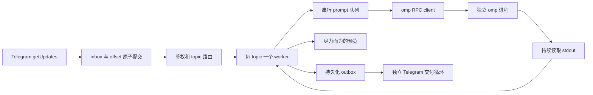
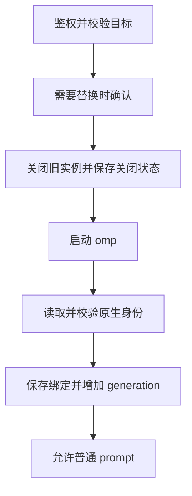

# 架构与开发说明

[English](architecture.md) | [用户指南](../README.zh.md)

本文描述当前实现. 尚未落地的启动意图设计单独标注, 不与现有行为混用.

## 范围与职责

桥接负责 Telegram polling, 鉴权, topic 路由, 子进程启动/关闭以及可靠消息交付. 模型执行, 工具, 配置, 凭据和原生会话历史由 omp 管理.

部署模型是一库一 Bot, 每个 topic 一个 worker. 不实现终端模拟, 第二份模型上下文, 多 Bot 分发器, 通用后端抽象或不确定任务的自动重放. 独立会话不等于文件系统或凭据隔离.

## 模块

| 位置 | 职责 |
| --- | --- |
| [`cmd/omp-telegram`](../cmd/omp-telegram/main.go) | CLI, 版本输出, 数据目录锁, 信号处理 |
| [`internal/config`](../internal/config/config.go) | TOML, 环境变量引用, 路径默认值, 启动参数校验 |
| [`internal/bridge`](../internal/bridge/bridge.go) | worker actor, 命令, prompt 队列, 预览, 最终回复和 host tool |
| [`internal/bridge/recovery.go`](../internal/bridge/recovery.go) | 启动恢复和关闭状态持久化 |
| [`internal/bridge/resume_picker.go`](../internal/bridge/resume_picker.go) | 原生会话列表, 带鉴权和过期控制的选择菜单 |
| [`internal/omp`](../internal/omp/client.go) | RPC 分帧, 请求关联, 事件, 原生会话元数据及 ACP 列表 |
| [`internal/telegram`](../internal/telegram/client.go) | Bot API, 附件传输, 错误脱敏及交付确定性 |
| [`internal/media`](../internal/media/media.go) | 限定工作目录的文件处理, 图片准备和发送快照 |
| [`internal/store`](../internal/store/store.go) | SQLite schema, 绑定, 持久化输入/输出及完成事务 |
| [`config.go`](../config.go) | 内嵌唯一的默认配置来源 [`config.toml`](../config.toml) |

## 运行流程



启动顺序为: 加载配置, 锁定数据目录, 初始化数据库并整理遗留状态, `getMe`, 校验数据库 Bot 归属, 注册命令, 恢复实例, 再启动 polling 和交付. `--version` 在加载配置前返回. `--check` 检查本地配置并创建配置中的目录, 不打开数据库或验证 Telegram 认证.

收到的 update 先持久化, 再进行路由鉴权. 未授权输入标记为 ignored, 不能启动进程, 下载文件或执行命令. 用户和 chat 必须同时在白名单中; 没有 topic 的消息只获得操作指引, 不推断目标话题.

### 并发模型

- 每个 topic 使用 actor 风格的 worker. 普通 prompt 串行执行, 不同 worker 可并行.
- 命令和 callback 走 worker 控制路径, 不排在待执行 prompt 队列后面. 这不等于每个操作都完全非阻塞: 启动和部分控制 RPC 往返仍需等待.
- 附件准备和上传异步且有并发上限. 尚在准备的附件保留其队列位置.
- RPC stdout reader 不执行 Telegram HTTP 交付. 事件缓冲有界, 协议错误或持续积压会使 client 失败, 不允许内存无限增长.
- 全局 slot 限制活动 topic 实例数量, 原生会话列表查询另有并发上限.

Client 等待 `ready` 并协商协议 v2, 串行写入 stdin, 按 request ID 关联响应. `Call("prompt")` 成功只代表请求被接受, 不代表任务完成. 只有终结 agent 事件或本地命令完成信号才能结束任务, 非终结事件不能开始下一条排队 prompt. 分帧和重组都有明确边界, 不回退到 PTY/ANSI 解析.

## 身份与过期工作

| 身份 | 表示 |
| --- | --- |
| Bot | `getMe` 返回的数字 ID, 不是 token 或 username |
| Topic | `(bot, chat, thread)` |
| 运行实例 | Topic 加 `generation` 及当前 client |
| 已保存会话 | omp 原生 session 文件路径 |
| 输入 update | 当前 Bot 所属数据库内唯一的 Telegram update ID |

`CheckBot` 拒绝其他 Bot 复用数据库. `daemon.lock` 防止两个桥接进程同时使用同一数据目录. 操作者仍需避免用不同数据目录或其他 polling 客户端重复运行同一个 Bot.

成功的新建/恢复实例会增加持久化 generation. 后台结果按对应的 generation, turn, 请求 token 或 client 身份校验. 会话 claim 防止同一 daemon 内两个 worker 同时打开同一个原生会话, 但不锁住工作目录供其他程序使用.

**关键是接受边界:** 旧运行时的迟到工作不能影响新实例, 但已经提交的 outbox 结果在 `/new` 或 `/close` 后仍可交付. generation 变化不能撤销已经接受的业务结果.

## SQLite

数据库是 `data_dir` 下的 `omp-telegram.db`, 使用 WAL, busy timeout 和单连接. 保存桥接状态及 Telegram 消息内容, 不维护另一份 omp 模型上下文.

| 表 | 键 / 字段 | 用途 |
| --- | --- | --- |
| `meta` | `key`, 整数 `value` | 所属 Bot ID 和 polling offset |
| `bindings` | 主键 `(bot,chat,thread)`; `workspace,session,generation,running` | 当前已验证的会话绑定和恢复资格 |
| `history` | `bot,chat,thread,workspace,session,generation` | 旧绑定快照, 不是会话浏览器 |
| `inbox` | 主键 `id`; `raw,state` | update 去重和处理状态 |
| `outbox` | 自增 `id`; `chat,thread,text,state,kind,path,name` | 按顺序交付文字和附件 |

热路径索引为 `inbox(state,id)` 和 `outbox(state,id)`. 当前没有自动清理保留期, 重试调度器, `source_update/seq` 映射或 inbox/outbox 的多 Bot namespace.

### Schema 版本

`PRAGMA user_version` 是数据库版本, 当前为 1. 空库在同一事务中创建表, 索引和版本号. 重新打开 v1 时保留结构, 整理上次运行留下的状态.

已有无版本库及不支持的版本在 schema 或记录修改前被拒绝. 开发阶段的字段探测和兼容性 ALTER 已明确移除. 正式发布后, 结构变更必须有显式的逐版本事务迁移, 成功后才推进版本. 旧程序必须拒绝更高版本的数据库. 应用版本和数据库版本独立变化.

### 输入与完成事务

```text
Telegram update
  -> 事务: 插入 inbox pending + 推进 offset
  -> 鉴权和路由
  -> 持久化 submitted
  -> 向 omp stdin 写入 prompt
  -> 收到终结事件
  -> 事务: 写入全部最终文本分段 + 标记 inbox done
```

`Accept` 为每个 update 执行一个原子事务. offset 不会先于输入持久化推进, 重复 update 不覆盖原记录.

普通任务通过 `CompleteInboxWithReplies` 完成: 输入必须处于 submitted, 全部最终文本分段和 `done` 一起提交, 任一步失败整体回滚. `say()` 仍是通知接口, 不用于完成任务. 控制命令的完成状态单独处理. 工具附件可在任务执行期间入队, 不追溯纳入最终文本事务.

完成事务失败时停止 worker, 不伪装成任务完成. 重启时 submitted 输入转为 `uncertain`, 旧的 pending 普通消息取消. 待处理控制命令仍正常鉴权; 依赖内存状态的旧 callback token 会随状态丢失而失效.

### 输出交付

```text
pending -> sending -> done
                   -> failed
                   -> uncertain

restart: sending -> uncertain
```

Telegram client 在传输边界区分错误:

- 本地发送前失败, 或可信且完整的 API 拒绝, 属于明确失败.
- 传输中断, 响应不完整或其他无法确认的交付, 保持不确定状态.
- 不能只看 HTTP 状态码分类. 之前发生的不确定性不能被后来的本地失败抹掉.

不为这两种终态增加自动重发. 明确的 Telegram 限流保留有界重试. 数据库事务无法与 Telegram 网络副作用原子提交, 因此不承诺 exactly-once.

## 会话生命周期

`/new` 解析工作目录, 替换已有运行实例时要求确认. 启动后通过 `get_state` 和结构化 `/session info` 命令输出读取原生身份, 校验结果, 注册桥接 host tool, 再保存绑定.

`/resume` 通过短生命周期的原生 `omp acp` 进程调用 `session/list`, 获取当前目录的会话列表. 桥接不扫描 session 文件, 不从 `history` 合成列表. 菜单使用随机 token, 校验所属用户, topic, generation, 过期时间和取消状态. 显式 `/resume ID` 交给 omp 原生查找, 可以恢复该会话的原目录.

`running` 表示恢复资格, 不是实时 PID 状态:

| 事件 | 持久化行为 |
| --- | --- |
| 成功启动/恢复 | 保存原生身份和 `running=1` |
| daemon 正常退出 | 保留恢复资格 |
| `/stop` | 保留实例和恢复资格, 清空等待 prompt |
| `/close` | 先保存 `running=0`, 再关闭实例 |
| worker 回收运行期故障实例 | 清除恢复资格, 活动任务转为不确定 |
| 自动恢复失败 | 保留身份和恢复资格, 供手动恢复或下次服务重启使用 |

启动恢复限定当前 Bot 和白名单 chat, 遵守 worker 上限, 使用保存的准确 session 文件和目录. 文件或目录缺失不会创建替代会话. omp 新会话可能先返回身份, 再持久化历史文件.

## 进程与文件安全

- 使用 argv 直接启动, 不经过 shell. 显式 `omp_args` 不允许覆盖桥接管理的 RPC 模式, cwd 或会话生命周期选项.
- 正常关闭先关闭 stdin 并继续读取输出, 必要时升级到进程组终止. 每个子进程只有一个 `Wait` 所有者.
- Linux RPC/ACP 启动使用父死亡 SIGTERM. Linux 将此信号关联到创建子进程的 OS 线程, 因此线程锁定到 `Wait` 完成, 每个存活原生子进程占一个锁定线程.
- 父死亡信号不是整个进程树 containment. 忽略信号, 后代残留, 脱离进程组或清除父死亡设置的程序, 仍需要部署层边界. 项目不强制 systemd/supervisor 配置.
- 输入附件限定在选定工作目录, 保存于 `.telegram/incoming/`. 输出文件先复制到 `data_dir/attachments/outbox/` 私有快照后入队, 交付确认后删除快照, 失败则保留.
- Host tool 受当前 topic/request 限制, 不能指定其他 Telegram 目标. 不将原始 RPC 状态, provider header, 凭据或 system prompt 写入日志或状态消息.

## 配置与路径契约

桥接默认路径以解析符号链接后的真实可执行文件目录为基准, 不是调用者 cwd. 显式相对 `--config` 路径相对于调用目录; 相对 `data_dir` 和 `workspace_root` 即使配置文件放在别处, 仍相对于二进制目录.

根目录 `config.toml` 只内嵌一份. 仅当隐式默认文件不存在时才使用内嵌配置, 显式缺失文件及不可读/无效文件均报错. 环境变量在 TOML 解析后只展开一次. `omp_args` 只进行支持引号的分词, 不执行 shell. 除显式配置或用户请求的 RPC 设置外, 不改变 omp 自身默认值.

## 启动意图: 仅设计

当前流程:



没有待替换实例时跳过关闭步骤. 在关闭/启动与保存新绑定之间崩溃, 可能丢失本次创建或切换目标. 已有启动恢复逻辑没有消除这个窗口.

后续设计必须区分:

| 情形 | 必须区分的信息 |
| --- | --- |
| A. 明确请求 new, 原生身份未知 | 持久化创建意图, 不能从空 session 字段猜测 |
| B. 已知 session 恢复失败 | 保留身份, 绝不降级成 new |
| C. 身份已知, 原生历史尚未持久化 | 不等于 A, 不制造历史文件或静默替换会话 |

建议边界是: spawn 前用准备事务记录明确操作, 冻结目标和尝试代数; 校验原生身份后, 再用带代数条件的发布事务完成绑定. 转换完成前保留最后有效身份, `/close` 必须取消待完成意图. 仅把 `session` 改成可空, 或移动 `Save` 的位置, 都不足以表达这些状态.

**这个意图模型及其数据库字段尚未实现.** 本轮不引入不确定创建操作的自动重试. 实现前必须确定残留进程处理及崩溃窗口行为.

## 开发与发布

```sh
just build
just check
just install
```

`just check` 执行测试, race 和 vet. `just install` 只复制二进制. `just test` 是维护者捷径: 先安装, 再通过已有服务配置执行 `supervisord ctl restart omp-telegram`, 不是单元测试命令.

保留能防止可观察回归的测试: 原子回滚, 重启身份保持, 鉴权, 取消, 交付不确定性和进程所有权. 真实 omp smoke 使用隔离的工作目录及数据库. 注入的 Telegram 输入或模拟 callback 不能当作手机端完整验收.

已有证据包括事务失败注入, 索引查询计划, 真实 omp 重启恢复, 以及注入输入配合真实 Telegram 文件传输. 父进程 SIGKILL 实验观察到配合清理的原生 omp/工具树退出, 独立夹具同时证明不配合的后代可以存活. 真实用户客户端输入/点击, 完整线上故障矩阵和长会话成功压缩仍待验收.

应用版本来自 [`cmd/omp-telegram/main.go`](../cmd/omp-telegram/main.go) 的 `Version`, 初始为 `v0.1.0`. `--version`/`-v` 在构建元数据可用时显示 Git revision/dirty 标记, 可通过 `-ldflags "-X main.Version=..."` 覆盖基础版本.

[发布工作流](../.github/workflows/release.yaml) 在 PR, `main`/`dev` push 及手动触发时运行. Linux amd64/arm64 分别原生构建和测试, amd64 额外执行 race. `main` 上的新源码版本创建正式 release, 不覆盖已有正式 tag. 其他构建使用 `dev-<版本>`; 成功的 `main`/`dev` 运行还会更新 `dev` tag 和开发草稿. PR 及其他分支手动运行不发布.

发布包包含二进制和 LICENSE, 并提供 `SHA256SUMS`. 只有发布 job 为 `GITHUB_TOKEN` 申请写权限. 发布新应用版本时, 将 `Version` 改为 `vMAJOR.MINOR.PATCH` 并合并/push 到 `main`, 不会自动改变数据库 schema 版本.
